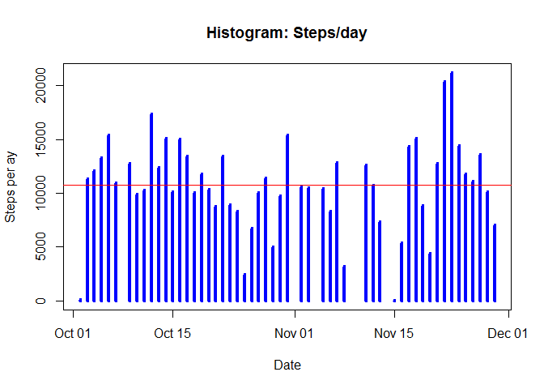
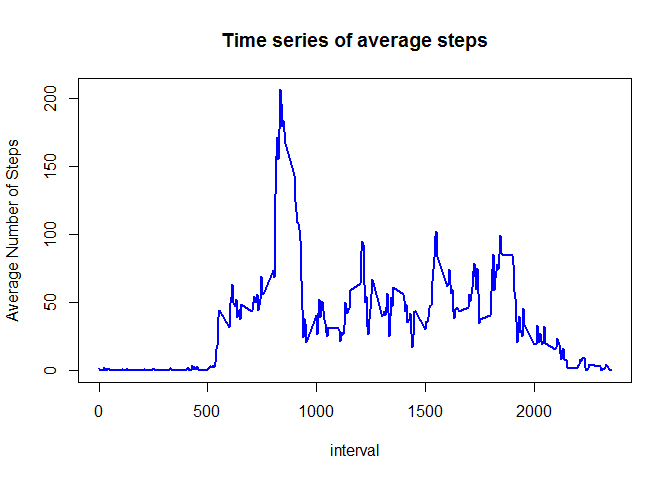
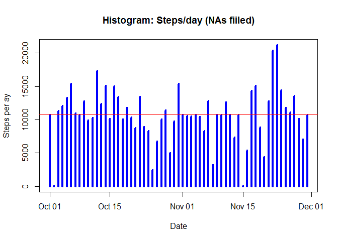
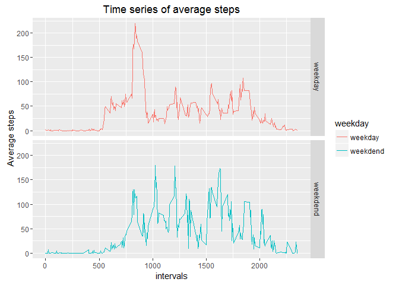

# Reproducible Research: Peer Assessment 1


## Loading the data

```r
activity_data<-read.csv("activity.csv")
```
## Converting the date variable into Date format

```r
library(plyr)
library(ggplot2)
activity_data$date<-as.Date(as.character(activity_data$date)) 
```
## What is mean total number of steps taken per day?

```r
SPD<-aggregate(data = activity_data,steps~date  , FUN=sum)
plot(SPD$date, SPD$steps, type="h", main="Histogram: Steps/day",xlab="Date", ylab="Steps per ay", col="blue",lwd=4)
m<-mean(SPD$steps)
abline(h=m, col="red")
```



```r
sprintf("Mean Steps per Day =%s",round(m,digits = 2))
```

```
## [1] "Mean Steps per Day =10766.19"
```

```r
sprintf("Median Steps per Day =%s",round(median(SPD$steps),digits = 2))
```

```
## [1] "Median Steps per Day =10765"
```


## What is the average daily activity pattern?

```r
S<-aggregate(data = activity_data,steps~interval , FUN=mean)
max_interval<-S[S$steps==max(S$steps),1]

plot(S$interval, S$steps, type="l", main="Time series of average steps",xlab="interval", ylab="Average Number of Steps", col="blue", lwd=2)
```



```r
sprintf("The interval that contains the maximum number of steps is: %s",max_interval)
```

```
## [1] "The interval that contains the maximum number of steps is: 835"
```

```r
sprintf("The number of NAs is:%s",sum(is.na(activity_data$steps)))
```

```
## [1] "The number of NAs is:2304"
```


```r
activity_filled_NAs<-activity_data
for(i in 1:nrow(activity_data))
{  
  if(is.na(activity_data$steps[i])) {
    l<-activity_data$interval[i]
    activity_filled_NAs$steps[i]<-S[which(S$interval==l),2]
  }  
}
```

## Imputing missing values


```r
SPD2<-aggregate(data = activity_filled_NAs,steps~date  , FUN=sum)
plot(SPD2$date, SPD2$steps, type="h", main="Histogram: Steps/day (NAs fiiled)",xlab="Date", ylab="Steps per ay", col="blue",lwd=4)
m2<-mean(SPD2$steps)
abline(h=m2, col="red")
```



```r
sprintf("Mean Steps per Day =%s",round(m2,digits = 2))
```

```
## [1] "Mean Steps per Day =10766.19"
```

```r
sprintf("Previous Mean Steps per Day =%s",round(m,digits = 2))
```

```
## [1] "Previous Mean Steps per Day =10766.19"
```

```r
sprintf("Median Steps per Day =%s",round(median(SPD2$steps),digits = 2))
```

```
## [1] "Median Steps per Day =10766.19"
```

```r
sprintf("Previous Median Steps per Day =%s",round(median(SPD$steps),digits = 2))
```

```
## [1] "Previous Median Steps per Day =10765"
```


```
## [1] "No they don't change the results"
```


## Are there differences in activity patterns between weekdays and weekends?

```r
 activity_filled_NAs$weekday<-weekdays(activity_filled_NAs$date)
suppressWarnings(for(i in 1:nrow(activity_filled_NAs))
{ 
  if(activity_filled_NAs$weekday[i]=="Sunday" || activity_filled_NAs$weekday=="Saturday")
    {
      activity_filled_NAs$weekday[i]<-"weekdend"
  }
 
  else activity_filled_NAs$weekday[i]<-"weekday"
})
activity_filled_NAs$weekday<-as.factor(activity_filled_NAs$weekday)
```


```r
S2<-aggregate(data = activity_filled_NAs,steps~interval*weekday , FUN=mean)
PLOT <- qplot(data =S2 ,x = interval, y = steps, color =weekday,facets= weekday~.,geom="line")
PLOT  +labs(x ="intervals",y ="Average steps",title ="Time series of average steps")
```



